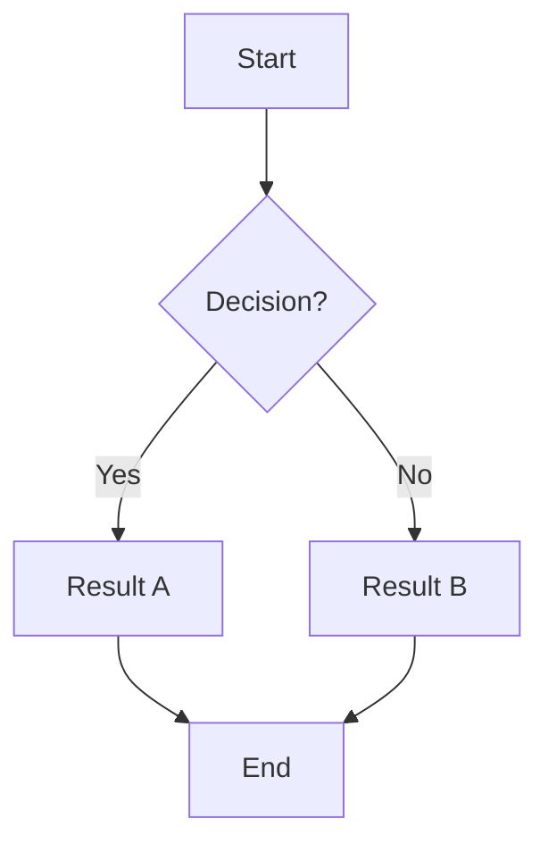
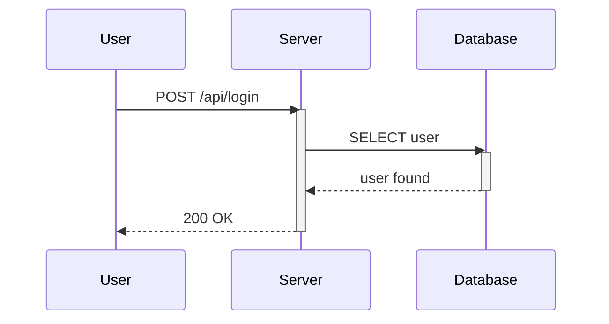
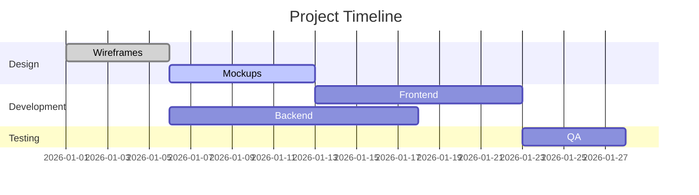
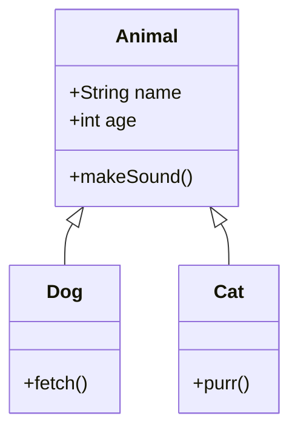
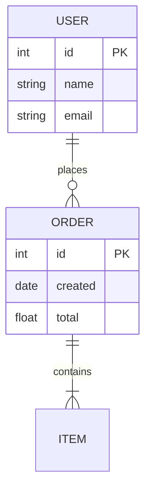
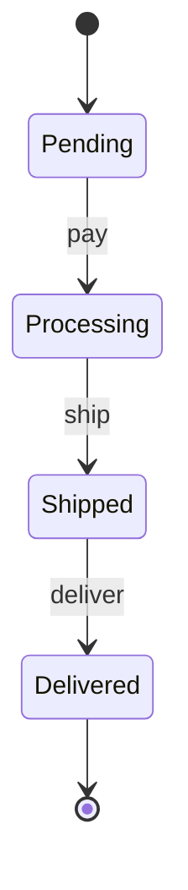
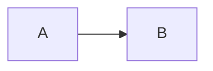

# Markdown-Studio Manual

Complete guide to learn, reference, and create Markdown artifacts from beginner to advanced. Based on the **CommonMark** and **GitHub Flavored Markdown (GFM)** specifications, with native support for **KaTeX** (mathematics) and **Mermaid** (diagrams).

> Markdown-Studio renders through the `marked → DOMPurify → mermaid` pipeline. What works here works on GitHub, GitLab, Obsidian, and almost every modern editor.

---

## Index

### Beginner

- [What is Markdown](#what-is-markdown)
- [Getting started](#getting-started)
- [Headings](#headings)
- [Emphasis and formatting](#emphasis-and-formatting)
- [Paragraphs and breaks](#paragraphs-and-breaks)
- [Lists](#lists)
- [Blockquotes](#blockquotes)
- [Code](#code)
- [Links and images](#links-and-images)

### Intermediate

- [Tables](#tables)
- [Task lists](#task-lists)
- [Strikethrough and autolinks](#strikethrough-and-autolinks)
- [Escaping characters](#escaping-characters)
- [HTML inside Markdown](#html-inside-markdown)
- [Page breaks](#page-breaks)

### Advanced

- [Math with KaTeX](#math-with-katex)
- [Diagrams with Mermaid](#diagrams-with-mermaid)
- [References and anchors](#references-and-anchors)

### Reference

- [Best practices](#best-practices)
- [Gotchas and solutions](#gotchas-and-solutions)
- [Quick cheat sheet](#quick-cheat-sheet)
- [Official references](#official-references)

---

# PART 1: BEGINNER

---

## What is Markdown

Markdown is a **lightweight markup language**: you write plain text with discreet symbols (`#`, `*`, `-`) and it becomes formatted structure (headings, lists, tables, code).

### Markdown Layers

| Layer          | What it is                             | Where it works                 |
| -------------- | -------------------------------------- | ------------------------------ |
| **CommonMark** | Strict standard (600+ test cases)      | Everywhere                     |
| **GFM**        | Superset: tables, tasks, strikethrough | GitHub, GitLab, modern editors |
| **Extensions** | Math, Mermaid, footnotes               | Specific tools                 |

**Rule of thumb**: write CommonMark + GFM — it works everywhere.

### Markdown Advantages

- **Simple**: learn in minutes
- **Portable**: one `.md` file becomes HTML, PDF, DOCX
- **Readable**: source text is clear even unrendered
- **Versionable**: Git diffs are meaningful
- **Universal**: supported by GitHub, Obsidian, VS Code, Notion, etc.

---

## Getting started

### Markdown-Studio Editor

- **Left panel**: Monaco editor with syntax highlighting
- **Right panel**: live rendered preview
- **Auto-save**: every 300ms to `localStorage`
- **Export**: PDF (raster or vector), standalone HTML

### How to test

1. Copy any example from this manual
2. Paste in the left editor
3. See the result on the right instantly

---

## Headings

Use `#` from **1 to 6 levels**. The `#` **needs a space** after it.

```markdown
# Heading H1 (one per document)

## Heading H2

### Heading H3

#### H4 · ##### H5 · ###### H6
```

**Renders as:**

# Heading H1 (one per document)

## Heading H2

### Heading H3

#### H4 · ##### H5 · ###### H6

### Best practices

- **One `#` (H1)** per document
- Use `##` and `###` for sections and subsections
- Leave **blank lines before and after** headings
- Prefer `#` over Setext style (`===`/`---`)

---

## Emphasis and formatting

| Effect              | Syntax                   | Result     |
| ------------------- | ------------------------ | ---------- |
| Italic              | `*text*` or `_text_`     | _text_     |
| Bold                | `**text**` or `__text__` | **text**   |
| Bold + Italic       | `***text***`             | **_text_** |
| Strikethrough (GFM) | `~~text~~`               | ~~text~~   |
| Inline code         | `` `code` ``             | `code`     |

**Prefer asterisks (`*`)** over underscores (`_`): underscores in identifiers (`variable_name`) may be interpreted as formatting.

---

## Paragraphs and breaks

- **Paragraph** = text followed by a **blank line**
- **Line break**: end with **two spaces** or `\`

```markdown
First paragraph.

Second paragraph (blank line separates).

First line (two spaces at end)  
Second line (same paragraph).
```

**Tip**: a single Enter does **not** break the line in the render.

---

## Lists

### Unordered

Use `-`, `*` or `+` followed by space. **Choose one and use always** (`-` is most common).

```markdown
- Item 1
- Item 2
  - Subitem
- Item 3
```

**Renders as:**

- Item 1
- Item 2
  - Subitem
- Item 3

### Ordered

Use number + period + space. **Shortcut**: number all as `1.`

```markdown
1. First
1. Second
1. Third
```

**Renders as:**

1. First
2. Second
3. Third

### Nested lists

The rule that causes most bugs: **sufficient indentation** (4 spaces is safe).

```markdown
- Main item
  - Subitem 1
  - Subitem 2
    1. Numeric sub
    2. Another
- Next main item
```

---

## Blockquotes

Use `>` at line start. Can contain **any Markdown element**.

```markdown
> Markdown is a lightweight markup language.
>
> > Nested quotes use `>>`.
```

**Renders as:**

> Markdown is a lightweight markup language.
>
> > Nested quotes use `>>`.

---

## Code

### Inline code

One backtick (\`) wraps text as code:

```markdown
Run `npm run quality` before committing.
```

If the snippet **contains a backtick**, use **two** as delimiters:

```markdown
Use ``code with `backtick` inside`` here.
```

### Fenced code blocks

Three backticks at start (with **language**) and three at end:

````markdown
```js
const message = 'Hello world';
console.log(message);
```

```bash
npm run quality
```

```python
print("Hello world")
```
````

**Supported languages**: js, ts, bash, python, sql, yaml, json, html, css, java, go, rust, etc.

---

## Links and images

### Links

```markdown
[Link text](https://example.com)
[Link with title](https://example.com 'Title on hover')
```

### Autolinks

```markdown
<https://commonmark.org>
<contact@example.com>
```

### Images

```markdown


```

**Tip**: make alt text **descriptive** for accessibility.

---

# PART 2: INTERMEDIATE

---

## Tables

**GFM extension**. Requires **header** + **separator row** + **cells**.

```markdown
| Column A | Column B | Column C |
| -------- | :------: | -------: |
| left     |  center  |    right |
| foo      |   bar    |      baz |
```

**Renders as:**

| Column A | Column B | Column C |
| -------- | :------: | -------: |
| left     |  center  |    right |
| foo      |   bar    |      baz |

### Alignment

| Syntax   | Alignment      |
| -------- | -------------- |
| `:---`   | left           |
| `:---:`  | center         |
| `---:`   | right          |
| (no `:`) | left (default) |

### Tips

- `|` literal inside cell: escape with `\|`
- Cells are **one line** (no colspan in GFM)
- Add **blank lines** before and after

---

## Task lists

**GFM extension**: `- [ ]` for pending, `- [x]` for completed.

```markdown
- [x] Document the pipeline
- [ ] Add tests
- [ ] Review the manual
```

**Renders as:**

- [x] Document the pipeline
- [ ] Add tests
- [ ] Review the manual

---

## Strikethrough and autolinks

### Strikethrough (GFM)

```markdown
~~Strikethrough text~~
```

**Renders as:** ~~Strikethrough text~~

### Autolinks

Addresses between `< >` become links automatically:

```markdown
<https://commonmark.org>
```

GFM converts **bare URLs** to links. For literal text, wrap in backticks.

---

## Escaping characters

To show a markup character as text, precede with `\`:

```markdown
\*not italic\* \#not heading \| not table
```

**Renders as:** \*not italic\* \#not heading \| not table

---

## HTML inside Markdown

Markdown-Studio allows **light HTML** (sanitizeed by DOMPurify):

```markdown
<details>
  <summary>Collapsible section</summary>

Content inside HTML.

</details>
```

**Security**: `<script>`, `on*` attributes, and `javascript:` URLs are removed.

---

## Page breaks

Markdown-Studio supports `<!-- page-break -->` marker for print/PDF:

```markdown
Content on first page.

<!-- page-break -->

Content on second page.
```

**Usage**: when exporting PDF or printing, content after the marker starts on a new page.

---

# PART 3: ADVANCED

---

## Math with KaTeX

Markdown-Studio natively supports **KaTeX** for mathematical formulas.

### Basic syntax

| Mode       | Syntax    | Example                            |
| ---------- | --------- | ---------------------------------- |
| **Inline** | `$...$`   | `$x^2$` renders $x^2$              |
| **Block**  | `$$...$$` | `$$\frac{a}{b}$$` renders centered |

### Inline examples

```markdown
The formula is $x = \frac{-b \pm \sqrt{b^2 - 4ac}}{2a}$.

Where $a \neq 0$ and $b^2 - 4ac \geq 0$.
```

### Block examples

```markdown
$$
\sum_{i=1}^{n} i = \frac{n(n+1)}{2}
$$
```

```markdown
$$
\int_{0}^{\infty} e^{-x^2} dx = \frac{\sqrt{\pi}}{2}
$$
```

### Common symbols

| Category      | Symbols                                                             |
| ------------- | ------------------------------------------------------------------- |
| **Greek**     | `\alpha` `\beta` `\gamma` `\delta` `\theta` `\pi` `\sigma` `\omega` |
| **Operators** | `\sum` `\prod` `\int` `\partial` `\nabla`                           |
| **Relations** | `\leq` `\geq` `\neq` `\approx` `\in` `\subset`                      |
| **Arrows**    | `\rightarrow` `\leftarrow` `\leftrightarrow` `\Rightarrow`          |
| **Fractions** | `\frac{a}{b}` `\dfrac{a}{b}` `\cfrac{1}{1+\cfrac{1}{2}}`            |
| **Roots**     | `\sqrt{x}` `\sqrt[3]{8}`                                            |
| **Matrices**  | `\begin{pmatrix} a & b \\ c & d \end{pmatrix}`                      |

### Real-world examples

**Physics — Mass-energy equivalence:**

```markdown
$$E^2 = (pc)^2 + (m_0 c^2)^2$$
```

**Statistics — Normal distribution:**

```markdown
$$f(x) = \frac{1}{\sigma\sqrt{2\pi}} e^{-\frac{(x-\mu)^2}{2\sigma^2}}$$
```

**Linear algebra — Eigenvalues:**

```markdown
$$A\mathbf{v} = \lambda\mathbf{v}$$
```

### KaTeX tips

1. **Blank lines** before and after `$$` blocks
2. **Escape** special signs: `\$50` for literal dollar
3. Use `\text{}` for words inside equations
4. Use `\left` and `\right` for auto-sizing brackets
5. Test in the editor before publishing

---

## Diagrams with Mermaid

Markdown-Studio natively supports **Mermaid** for diagrams.

### Flowchart

````markdown

````

**Node types:**

| Syntax     | Shape      | Example           |
| ---------- | ---------- | ----------------- |
| `[text]`   | Rectangle  | `[Process]`       |
| `(text)`   | Rounded    | `(Alternative)`   |
| `{text}`   | Diamond    | `{Decision}`      |
| `([text])` | Stadium    | `([Start/End])`   |
| `[(text)]` | Database   | `[(MySQL)]`       |
| `((text))` | Circle     | `((Connector))`   |
| `[[text]]` | Subroutine | `[[Function]]`    |
| `{{text}}` | Hexagon    | `{{Preparation}}` |

### Sequence Diagram

````markdown

````

**Message types:**

| Syntax | Meaning                    |
| ------ | -------------------------- |
| `->>`  | Solid arrow (synchronous)  |
| `-->>` | Dashed arrow (response)    |
| `-x`   | Solid cross (lost message) |
| `--)`  | Open arrow (async)         |

### Gantt Chart

````markdown

````

### Class Diagram

````markdown

````

### ER Diagram

````markdown

````

### State Diagram

````markdown

````

### Mermaid Tips

1. **Always define direction** for flowcharts: `TD`, `TB`, `LR`, `RL`, `BT`
2. **Escape special characters** in nodes: `A["Process (v2)"]`
3. **Use `%` for comments**: `% this is a comment`
4. **Beware reserved words**: "end" can break diagrams
5. **Test in the editor** before publishing

---

## References and anchors

### Reference links

Define destination once and reuse:

```markdown
See the [documentation][docs] and the [specification][spec].

[docs]: https://example.com/docs 'Official docs'
[spec]: https://example.com/spec 'Specification'
```

### Internal anchors

Headings get automatic `id`. Direct link to section:

```markdown
[Back to index](#index)
```

---

# PART 4: REFERENCE

---

## Best practices

1. **One H1 per document**; `##`/`###` for sections
2. **Blank lines** between blocks
3. **One list marker only** (`-` throughout)
4. **Asterisks** for emphasis (`*italic*`, `**bold**`)
5. **Language always** in code blocks
6. **Descriptive alt text** for every image
7. **4-space indentation** for nested lists
8. **Reference links** when same URL appears multiple times
9. **Think about readers**: good Markdown is readable in plain text

---

## Gotchas and solutions

| Gotcha                      | Cause                    | Solution               |
| --------------------------- | ------------------------ | ---------------------- |
| Heading doesn't render      | `#` without space        | `# Heading`            |
| List breaks                 | Different markers        | Use `-` consistently   |
| Sublist becomes paragraph   | Insufficient indentation | 4 spaces               |
| Enter doesn't create line   | Single Enter joins lines | Blank line or 2 spaces |
| Emphasis in `variable_name` | `_` interpreted          | Use `*`                |
| Table fails                 | Missing separator        | Include `\|--\|--\|`   |
| Backtick inside code        | One backtick breaks      | Use two: `` `code` ``  |
| Strikethrough fails         | `~text~` (one tilde)     | `~~text~~` (GFM)       |
| KaTeX doesn't render        | `$ x+1 $` (spaces)       | `$x+1$` (no spaces)    |
| Mermaid breaks              | Word "end"               | Use quotes: `["end"]`  |

---

## Quick cheat sheet

````markdown
# Heading

## Subheading

**bold** _italic_ ~~strikethrough~~ `code`

- list

1. numbered

> quote

[link](https://example.com)


```js
console.log('code');
```

| a   | b   |
| --- | --- |
| 1   | 2   |

- [ ] task

$x^2$ (KaTeX inline)

$$\sum_{i=1}^{n} i$$ (KaTeX block)



<!-- page-break -->
````

---

## Official references

- **CommonMark Spec** — <https://spec.commonmark.org>
- **GFM Spec** — <https://github.github.io/gfm>
- **KaTeX** — <https://katex.org/docs/supported.html>
- **Mermaid** — <https://mermaid.js.org>
- **CommonMark Help** — <https://commonmark.org/help>

---

_Markdown-Studio Manual v1.2 — Updated September 2026_
