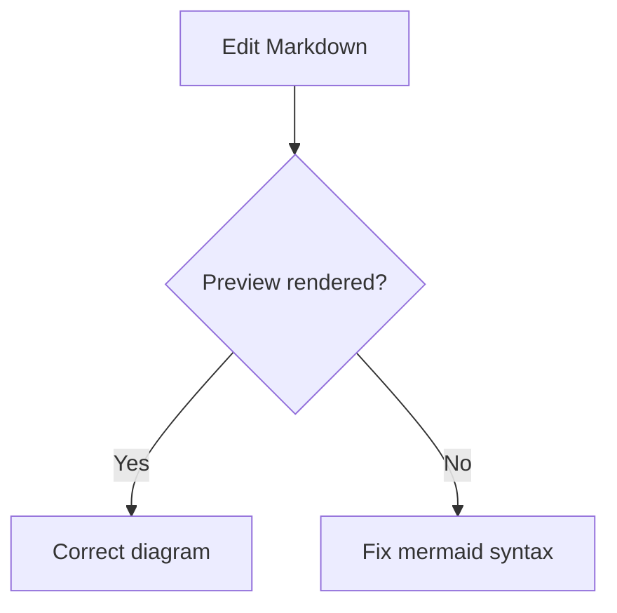
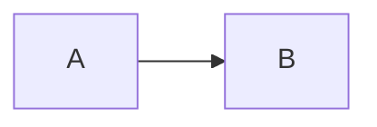

# Markdown Manual

A modern, practical and complete guide to learn, consult and edit Markdown documents inside **Markdown-Studio**. Based on the **CommonMark** specification and the **GitHub Flavored Markdown (GFM)** extensions, with ready-to-run examples you can try in the editing panel.

> Markdown-Studio renders Markdown through the `marked → DOMPurify → mermaid` pipeline. Everything in this manual works here — and, at the "common layer" (CommonMark + GFM), it also works on GitHub, GitLab, Obsidian and almost every modern editor.

---

## Table of contents

1. [What is Markdown](#what-is-markdown)
2. [How to write and edit](#how-to-write-and-edit)
3. [Headings](#headings)
4. [Emphasis and text formatting](#emphasis-and-text-formatting)
5. [Paragraphs and line breaks](#paragraphs-and-line-breaks)
6. [Lists](#lists)
7. [Blockquotes](#blockquotes)
8. [Code](#code)
9. [Links](#links)
10. [Images](#images)
11. [Horizontal rules](#horizontal-rules)
12. [Tables](#tables)
13. [Task lists](#task-lists)
14. [Escaping characters](#escaping-characters)
15. [HTML inside Markdown](#html-inside-markdown)
16. [Mermaid diagrams](#mermaid-diagrams)
17. [Best practices](#best-practices)
18. [Gotchas and how to avoid them](#gotchas-and-how-to-avoid-them)
19. [Quick reference](#quick-reference)
20. [Official references](#official-references)

---

## What is Markdown

Markdown is a **lightweight markup language**: you write plain text with discreet symbols (`#`, `*`, `-`) and it turns into formatted structure (headings, lists, tables, code). It was created in **2004** by **John Gruber** with help from **Aaron Swartz**, designed for people who want to publish on the web without typing HTML.

Three important layers:

- **CommonMark** — the strict standard (2014, led by John MacFarlane), with more than 600 test cases. It defines unambiguously how each construction is interpreted.
- **GFM (GitHub Flavored Markdown)** — a superset of CommonMark that adds **tables, task lists, strikethrough (`~~`) and autolinks**. This is the dialect used on GitHub, GitLab and most modern editors.
- **Specific extensions** — math, Mermaid diagrams, footnotes, highlights. They work in specific tools and may break elsewhere. Use them carefully when the destination is unknown.

Rule of thumb: **write CommonMark + GFM** (what this manual teaches) — it works everywhere.

## How to write and edit

- **Editor on the left, preview on the right** — every keystroke updates the preview in real time.
- **Pick an example, copy and adapt.** Everything in the manual is editable text.
- **Your work is saved to `localStorage` automatically** (every 300 ms). Use **Reset** to go back to the template, and **Open/Save file** in the sidebar to work with real files on your computer.
- **Print** uses the printers installed on your system (via the browser print dialog).
- The preview is **sanitized** (DOMPurify): unsafe content is removed, including potentially dangerous HTML.

## Headings

Use `#` for **1 to 6 levels** (level 1 = most important, level 6 = smallest). The `#` **needs a space** after it to become a heading — `#NoSpace` does not work.

```markdown
# H1 heading (use only one per document)

## H2 heading

### H3 heading

#### H4 heading

##### H5 heading

###### H6 heading
```

Best practices:

- **A single `#` (H1)** per document — it works as your main title.
- Use `##` and `###` for sections and subsections; skip levels sparingly (H2 → H4 confuses navigation and accessibility).
- Leave a **blank line before and after** the heading.
- The alternative "Setext" form (`Text` + a line of `===` or `---` below) exists, but only covers 2 levels. Prefer `#`.

```
# I can be
```

## Emphasis and text formatting

| Effect              | Syntax                  | Result                |
| ------------------- | ----------------------- | --------------------- |
| Italic              | `*text*`                | _text_                |
| Italic              | `_text_`                | _text_                |
| Bold                | `**text**`              | **text**              |
| Bold                | `__text__`              | **text**              |
| Strikethrough (GFM) | `~~text~~`              | ~~text~~              |
| Combined            | `**bold _and italic_**` | **bold _and italic_** |

**Prefer asterisks (`*`) over underscores (`_`)** for emphasis: an underscore inside identifiers (`my_var`) can be parsed as markup. Asterisks never cause that confusion. To show a literal character on purpose, **escape it** (`\*asterisks\*`).

## Paragraphs and line breaks

- **Paragraph** = text followed by a **blank line**.
- **Line break** within the same paragraph: end the line with **two spaces** or a backslash `\`.

```markdown
First paragraph.

Second paragraph (the blank line separates them).

This is the first line (two trailing spaces)  
and this is already another line, even without a new paragraph.
```

A single Enter does **not** break the line in the render: letters join into the same block. If pasted text became all continuous, insert blank lines between paragraphs.

## Lists

### Unordered

Use `-`, `*` or `+` followed by a space. **Pick one and use it throughout the document** (`-` is the most common). Mixing the three in the same document can split the list.

```markdown
- Item 1
- Item 2
- Item 3
```

### Ordered

Use number + period + space. **Shortcut**: number all items as `1.` — the renderer increments them automatically (`1. 1. 1.` becomes `1. 2. 3.`).

```markdown
1. First
1. Second
1. Third
```

### Nested lists (sublists)

The rule that causes most bugs: **nested content needs enough indentation to get past the marker position**. Four spaces always work as a safe default.

```markdown
- Main item
  - Subitem 1
  - Subitem 2
    1. Sub-numbered
    2. Another
- Next main item
```

### Mixed lists inside a blockquote

```markdown
> - Task in a blockquote
> - Another task
```

## Blockquotes

Use `>` at the start of the line. Blockquotes can contain **any other Markdown element** (headings, lists, code) — they are containers.

```markdown
> Markdown is a lightweight markup language.
>
> > Nested blockquotes use `>>`.
```

## Code

### Inline code

A backtick (`) wraps text as display code. Use it for command names, variables, paths and short snippets.

```markdown
Run `npm run quality` before committing.
```

If the snippet **contains a backtick**, use **two** as the delimiter:

```
Use ``code with a `backtick` inside`` here.
```

### Fenced code blocks

Three backticks at the start (with a **language** for highlighting) and three at the end. Every line in the block is **literal text** — no markup is interpreted inside.

````markdown
```js
const message = 'Hello world';
console.log(message);
```

```bash
npm run quality
```
````

Without a language, the block still gets monospace font, just without highlighting:

```
literal text, no formatting
```

### Indented block (legacy)

Four spaces at the start also create a code block, but **without syntax highlighting**. Prefer the fenced form.

```markdown
    const legacy = true;
```

## Links

### Inline link

Text between `[ ]`, address between `( )`, optional title between quotes:

```markdown
[Markdown-Studio](https://example.com/ 'Optional hover title')
[Common site](https://example.com)
```

### Reference link

Define the destination once and reuse it several times. The label is **case-insensitive** and does not appear in the result:

```markdown
See the [documentation][docs] and the [specification][DOCS].

[docs]: https://example.com/docs 'Official docs'
```

### Autolinks

Addresses between `< >` become links using the text itself:

```markdown
<https://commonmark.org>
<contact@example.com>
```

GFM also converts **bare URLs** (without `< >`) into links. To send a URL "literally", wrap it in backticks: `` `https://example.com` `` becomes text.

### Internal anchors

Headings get an automatic `id` (GitHub and many renderers). Direct link to a section:

```markdown
[Back to the index](#table-of-contents)
```

## Images

Same syntax as a link, with `!` before it. The **alternative text** (inside the `[]`) is required for accessibility and appears when the image fails.

```markdown

```

```markdown

```

- Make the alt text **descriptive**: `![Pipeline architecture diagram]`. Avoid `![img1]`.
- Images inside tables or lists work normally.

## Horizontal rules

Three or more identical characters on their own line: `-`, `*` or `_`. The `---` form is the most common. Use them sparingly — **titles organize better** than decorative lines.

```markdown
---
---
```

## Tables

A **GFM** extension (it does not exist in plain CommonMark). A table has a **header**, a **separator row** and cells separated by `|`. Without the separator row it does not become a table!

```markdown
| Column A | Column B | Column C |
| -------- | :------: | -------: |
| left     |  center  |    right |
| foo      |   bar    |      baz |
```

Alignment is defined by the **colons in the separator row**:

| Syntax   | Alignment      |
| -------- | -------------- |
| `:---`   | left           |
| `:---:`  | center         |
| `---:`   | right          |
| (no `:`) | left (default) |

Tips:

- **Literal `|`** inside a cell: escape with `\|`.
- Cells are **one line**; no cell merging (GFM has no colspan) — use an HTML table for that.
- Add **blank lines** before and after the table.

## Task lists

**GFM** extension: `- [ ]` for unchecked and `- [x]` for checked. The `x` is case-insensitive.

```markdown
- [x] Document the pipeline
- [ ] Add tests
- [ ] Review the manual
```

## Escaping characters

To show a markup character as text, precede it with a **backslash**:

```markdown
\*not italic\* \#not a heading | not a table
```

Only escape what needs it: in `2*3 = 6` the `*` does not open emphasis if there is no pair.

## HTML inside Markdown

CommonMark allows **raw HTML**, and GFM only blocks a specific set of dangerous tags. In Markdown-Studio **everything goes through DOMPurify** — tags like `<script>`, `on*` attributes and `javascript:` URLs are removed for safety. Light structural HTML is usually accepted:

````markdown
<details>
  <summary>Collapsible section (supported by several renderers)</summary>

```markdown
Literal content inside HTML.
```

</details>
````

> **Security over convenience.** Never trust Markdown from an unknown source without sanitization. Here sanitization is automatic and upfront.

## Mermaid diagrams

A Markdown-Studio feature: a block with the `mermaid` language becomes a **rendered diagram** (flowchart, sequence, Gantt, class, etc.). Rendering is scheduled with a 150 ms _debounce_ and protected against version race conditions.



To write the **source code** of a diagram without rendering it, use a longer block delimiter:

````markdown

````

## Best practices

1. **One H1 per document**; `##`/`###` for sections.
2. **Blank lines** between blocks (heading, list, code, table, blockquote).
3. **A single list marker**: `-` throughout the document.
4. **Asterisks** for emphasis (`*italic*`, `**bold**`).
5. **Always a language** on code blocks: `js`, `bash`, `python`, `sql`, `yaml`, `json`, `html`, `css`.
6. **Descriptive alt text** on every image.
7. **4-space indentation** for sublists and nested code.
8. **Escape what is literal**: `\*`, `\|`, `\#`, `\~`.
9. **Reference links** when the same URL appears several times.
10. **Think about the reader**: good Markdown is readable even as plain text.

## Gotchas and how to avoid them

| Gotcha                          | Cause                                             | Fix                                                          |
| ------------------------------- | ------------------------------------------------- | ------------------------------------------------------------ |
| Heading does not render         | `#` without space or without blank line before    | `# Heading` + blank lines around it                          |
| List breaks/mixes               | Different markers (`-`, `*`, `+`) in the same doc | Stick to `-`                                                 |
| Sublist becomes a paragraph     | Insufficient indentation                          | 4 spaces for the nesting                                     |
| Enter does not create a line    | A single Enter joins the lines                    | Blank line (paragraph) or 2 spaces (break)                   |
| Emphasis on identifier with `_` | `my_var` interpreted                              | Use `*` for emphasis                                         |
| Table does not become a table   | Missing separator row `\|--\|--\|`                | Include a separator with at least 3 hyphens                  |
| Backtick inside inline code     | One backtick breaks the block                     | Use two backticks: `` `code with ` ` ` ``                    |
| Code translates markup          | Regular code block interprets `*` etc.            | Use a **fence** (` ` ```) for full literal                   |
| Strikethrough does not work     | Used `~text~` (single tilde)                      | Use `~~text~~` (GFM)                                         |
| Link broken by parentheses      | Parens in the destination without escaping        | `https://en.wikipedia.org/wiki/Markdown_(markup)` or `<url>` |

## Quick reference

````markdown
# Title

## Subtitle

**bold** ~~strikethrough~~ `code`

- list

1. numbered

> blockquote

[link](https://example.com)


```js
console.log('code');
```

| a   | b   |
| --- | --- |
| 1   | 2   |

- [ ] pending task
````

## Official references

- **CommonMark Spec** — <https://spec.commonmark.org>
- **GFM Spec** — <https://github.github.io/gfm>
- **CommonMark help** — <https://commonmark.org/help>
- **Mermaid** — <https://mermaid.js.org>

---
