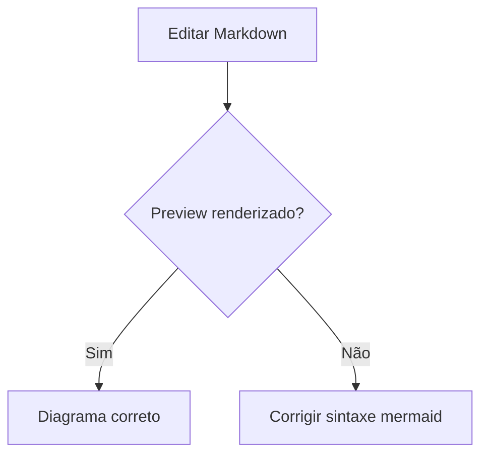
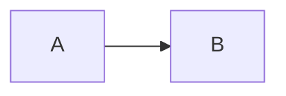

# Manual do Markdown

Guia moderno, prático e completo para aprender, consultar e editar documentos Markdown dentro do **Markdown-Studio**. Baseado na especificação **CommonMark** e nas extensões **GitHub Flavored Markdown (GFM)**, com exemplos prontos para testar no painel de edição.

> O Markdown-Studio renderiza Markdown pelo pipeline `marked → DOMPurify → mermaid`. O que está neste manual funciona aqui — e, no nível da "camada comum" (CommonMark + GFM), funciona também no GitHub, GitLab, Obsidian e quase todos os editores modernos.

---

## Índice

1. [O que é Markdown](#o-que-e-markdown)
2. [Como escrever e editar](#como-escrever-e-editar)
3. [Cabeçalhos](#cabecalhos)
4. [Ênfase e formatação de texto](#enfase-e-formatacao-de-texto)
5. [Parágrafos e quebras de linha](#paragrafos-e-quebras-de-linha)
6. [Listas](#listas)
7. [Citações](#citacoes)
8. [Código](#codigo)
9. [Links](#links)
10. [Imagens](#imagens)
11. [Regras horizontais](#regras-horizontais)
12. [Tabelas](#tabelas)
13. [Listas de tarefas](#listas-de-tarefas)
14. [Escapando caracteres](#escapando-caracteres)
15. [HTML dentro do Markdown](#html-dentro-do-markdown)
16. [Diagramas Mermaid](#diagramas-mermaid)
17. [Boas práticas](#boas-praticas)
18. [Pegadinhas e como evitá-las](#pegadinhas-e-como-evita-las)
19. [Referência rápida](#referencia-rapida)
20. [Referências oficiais](#referencias-oficiais)

---

## O que é Markdown

Markdown é uma **linguagem de marcação leve**: você escreve texto simples com símbolos discretos (`#`, `*`, `-`) e ele vira estrutura formatada (títulos, listas, tabelas, código). Foi criado em **2004** por **John Gruber** com ajuda de **Aaron Swartz**, pensado para pessoas que querem publicar na web sem digitar HTML.

Três camadas importantes:

- **CommonMark** — o padrão rigoroso (2014, liderado por John MacFarlane), com mais de 600 casos de teste. É ele que define sem ambiguidade como cada construção é interpretada.
- **GFM (GitHub Flavored Markdown)** — um superconjunto do CommonMark que adiciona **tabelas, listas de tarefas, riscado (`~~`) e autolinks**. É o dialeto usado no GitHub, GitLab e na maioria dos editores modernos.
- **Extensões específicas** — math, diagramas Mermaid, notas de rodapé, destaques. Funcionam em ferramentas específicas e podem quebrar em outras. Use com cuidado quando o destino for desconhecido.

Regra prática: **escreva CommonMark + GFM** (o que este manual ensina) — funciona em todos os lugares.

## Como escrever e editar

- **Editor à esquerda, preview à direita** — cada tecla atualiza o preview em tempo real.
- **Escolha o exemplo, copie e adapte.** Tudo no manual é texto editável.
- **Salve seu trabalho em `localStorage` automaticamente** (a cada 300 ms). Use **Reset** para voltar ao modelo, e **Abrir/Salvar arquivo** na barra lateral para trabalhar com arquivos reais do seu computador.
- **Imprimir** usa as impressoras instaladas no seu sistema (via diálogo de impressão do navegador).
- O preview é **sanitizado** (DOMPurify): conteúdo inseguro é removido, incluindo HTML potencialmente perigoso.

## Cabeçalhos

Use `#` de **1 a 6 níveis** (nível 1 = mais importante, nível 6 = menor). O `#` **precisa de um espaço** depois para virar cabeçalho — `#SemEspaço` não funciona.

```markdown
# Título H1 (use um só por documento)

## Título H2

### Título H3

#### Título H4

##### Título H5

###### Título H6
```

Boas práticas:

- **Um único `#` (H1)** por documento — funciona como título principal.
- Use `##` e `###` para seções e subseções; pule níveis com moderação (H2 → H4 confunde navegação e acessibilidade).
- Deixe **linha em branco antes e depois** do cabeçalho.
- A forma alternativa "Setext" (`Texto` + linha `===` ou `---` abaixo) existe, mas só cobre 2 níveis. Prefira `#`.

```
# Eu posso ser
```

## Ênfase e formatação de texto

| Efeito        | Sintaxe                   | Resultado               |
| ------------- | ------------------------- | ----------------------- |
| Itálico       | `*texto*`                 | _texto_                 |
| Itálico       | `_texto_`                 | _texto_                 |
| Negrito       | `**texto**`               | **texto**               |
| Negrito       | `__texto__`               | **texto**               |
| Riscado (GFM) | `~~texto~~`               | ~~texto~~               |
| Combinar      | `**negrito _e itálico_**` | **negrito _e itálico_** |

**Prefira asteriscos (`*`) a underscores (`_`)** para ênfase: underscore dentro de identificadores (`variavel_nome`) pode ser interpretado como marcação. Asteriscos nunca geram essa confusão. Para errar de propósito, **escape o caractere** (`\*aspas\*`).

## Parágrafos e quebras de linha

- **Parágrafo** = texto seguido de **linha em branco**.
- **Quebra de linha** dentro do mesmo parágrafo: termine a linha com **dois espaços** ou barra invertida `\`.

```markdown
Primeiro parágrafo.

Segundo parágrafo (a linha em branco separa).

Esta é a primeira linha (dois espaços no fim)  
e esta já é outra linha, mesmo sem parágrafo novo.
```

Um Enter simples **não** quebra a linha no render: as letras se juntam num mesmo bloco. Se o texto foi "colado" e ficou tudo contínuo, insira linhas em branco entre parágrafos.

## Listas

### Não ordenadas

Use `-`, `*` ou `+` seguido de espaço. **Escolha um e use-o em todo o documento** (o `-` é o mais comum). Misturar os três no mesmo documento pode dividir a lista.

```markdown
- Item 1
- Item 2
- Item 3
```

### Ordenadas

Use número + ponto + espaço. **Atalho**: numerar todos como `1.` — o renderizador incrementa sozinho (`1. 1. 1.` vira `1. 2. 3.`).

```markdown
1. Primeiro
1. Segundo
1. Terceiro
```

### Listas aninhadas (sublistas)

A regra que mais causa bugs: **o conteúdo aninhado precisa de indentação suficiente para sair da posição do marcador**. Quatro espaços sempre funcionam como padrão seguro.

```markdown
- Item principal
  - Subitem 1
  - Subitem 2
    1. Sub-numérico
    2. Outro
- Próximo item principal
```

### Listas mistas dentro de citação

```markdown
> - Tarefa em citação
> - Outra tarefa
```

## Citações

Use `>` no início da linha. Citações podem conter **qualquer outro elemento Markdown** (títulos, listas, código) — são contêineres.

```markdown
> Markdown é uma linguagem de marcação leve.
>
> > Citações aninhadas usam `>>`.
```

## Código

### Código em linha (inline)

Uma crase (\`) envolve texto como código de exibição. Use para nomes de comando, variáveis, caminhos e trechos curtos.

```markdown
Rode `npm run quality` antes de commitar.
```

Se o trecho **contiver uma crase**, use **duas** como delimitador:

```
Use ``código com `crase` no meio`` aqui.
```

### Blocos de código (fenced)

Três crases no início (com **linguagem** para realce) e três no fim. Todas as linhas do bloco são **texto literal** — nenhuma marcação é interpretada dentro delas.

````markdown
```js
const mensagem = 'Olá mundo';
console.log(mensagem);
```

```bash
npm run quality
```
````

Sem linguagem, o bloco ainda fica em fonte monoespaçada, só sem realce:

```
texto literal, sem formatação
```

### Bloco indentado (legado)

Quatro espaços no início também criam bloco de código, mas **sem realce de sintaxe**. Prefira as crases.

```markdown
    const legado = true;
```

## Links

### Link embutido (inline)

Texto entre `[ ]`, endereço entre `( )`, título opcional entre aspas:

```markdown
[Markdown-Studio](https://exemplo.com/ 'Título opcional no hover')
[Site comum](https://exemplo.com)
```

### Link por referência

Define o destino uma vez e reusa várias. O rótulo é **insensível a maiúsculas** e não aparece no resultado:

```markdown
Veja a [documentação][docs] e a [especificação][DOCS].

[docs]: https://example.com/docs 'Docs oficiais'
```

### Autolinks

Endereços entre `< >` viram link usando o próprio texto:

```markdown
<https://commonmark.org>
<contato@example.com>
```

GFM ainda converte **URLs nua** (sem `< >`) em link. Para enviar uma URL "ao pé da letra", envolva em crases: `https://exemplo.com` vira texto.

### Âncoras internas

Cabeçalhos ganham `id` automático (GitHub e muitos renderizadores). Link direto para a seção:

```markdown
[Voltar ao índice](#indice)
```

## Imagens

Sintaxe igual ao link, com `!` antes. O **texto alternativo** (dentro dos `[]`) é obrigatório para acessibilidade e aparece quando a imagem falha.

```markdown

```

```markdown

```

- Torne o texto alternativo **descritivo**: `![Diagrama de arquitetura do pipeline]`. Evite `![img1]`.
- Imagens dentro de tabelas ou listas funcionam normalmente.

## Regras horizontais

Três ou mais caracteres iguais em linha própria: `-`, `*` ou `_`. O `---` é o mais comum. Use com moderação — **títulos organizam melhor** que linhas decorativas.

```markdown
---
---
```

## Tabelas

Extensão **GFM** (não existe no CommonMark puro). A tabela tem **cabeçalho**, **linha separadora** e células separadas por `|`. Sem a linha separadora, não vira tabela!

```markdown
| Coluna A | Coluna B | Coluna C |
| -------- | :------: | -------: |
| esquerda |  centro  |  direita |
| foo      |   bar    |      baz |
```

O alinhamento é definido pelos **dois-pontos na linha separadora**:

| Sintaxe   | Alinhamento       |
| --------- | ----------------- |
| `:---`    | esquerda          |
| `:---:`   | centro            |
| `---:`    | direita           |
| (sem `:`) | esquerda (padrão) |

Dicas:

- **`|` literal** dentro de célula: escape com `\|`.
- Células são **uma linha**; sem mesclar células (GFM não tem colspan) — para isso, use HTML de tabela.
- Adicione **linhas em branco** antes e depois da tabela.

## Listas de tarefas

Extensão **GFM**: `- [ ]` para desmarcado e `- [x]` para marcado. O `x` ignora maiúsculas.

```markdown
- [x] Documentar o pipeline
- [ ] Adicionar testes
- [ ] Revisar o manual
```

## Escapando caracteres

Para mostrar um caractere de marcação como texto, preceda de **barra invertida**:

```markdown
\*não é itálico\* \#não é cabeçalho ​| não é tabela
```

Só precisa escapar o necessitado: em `2*3 = 6` o `*` não abre ênfase se não houver par.

## HTML dentro do Markdown

CommonMark permite **HTML bruto**, e o GFM bloqueia apenas um conjunto específico de tags perigosas. No Markdown-Studio, **tudo passa por DOMPurify** — tags como `<script>`, atributos `on*` e URLs `javascript:` são removidos por segurança. HTML estrutural leve costuma ser aceito:

````markdown
<details>
  <summary>Seção recolhível (suportada por vários renderizadores)</summary>

```markdown
Conteúdo literal dentro de HTML.
```

</details>
````

> **Segurança > comodidade.** Nunca confie em Markdown de origem desconhecida sem sanitização. Aqui a sanitização é automática e frontal.

## Diagramas Mermaid

Extensão própria do Markdown-Studio: bloco com linguagem `mermaid` vira **diagrama renderizado** (flowchart, sequência, Gantt, classes, etc.). O render é agendado com _debounce_ de 150 ms e protegido contra corridas (race conditions) de versão.



Para escrever o **código-fonte** de um diagrama sem renderizá-lo, use outro delimitador de bloco longo:

````markdown

````

## Boas práticas

1. **Um H1 por documento**; `##`/`###` para seções.
2. **Linhas em branco** entre blocos (cabeçalho, lista, código, tabela, citação).
3. **Um marcador de lista só**: `-` em todo o documento.
4. **Asteriscos** para ênfase (`*itálico*`, `**negrito**`).
5. **Linguagem sempre** nos blocos de código: `js`, `bash`, `python`, `sql`, `yaml`, `json`, `html`, `css`.
6. **Alt text descritivo** em toda imagem.
7. **Indentação de 4 espaços** para sublistas e código aninhado.
8. **Escapa o que é literal**: `\*`, `\|`, `\#`, `\~`.
9. **Links por referência** quando o mesmo URL aparece várias vezes.
10. **Pense em quem lê**: Markdown bom é Markdown legível até em texto puro.

## Pegadinhas e como evitá-las

| Pegadinha                       | Causa                                              | Correção                                                     |
| ------------------------------- | -------------------------------------------------- | ------------------------------------------------------------ |
| Título não renderiza            | `#` sem espaço ou sem linha em branco antes        | `# Título` + linha em branco ao redor                        |
| Lista quebra/mistura            | Marcadores diferentes (`-`, `*`, `+`) no mesmo doc | Fixar `-`                                                    |
| Sublista vira parágrafo         | Indentação insuficiente                            | 4 espaços para o aninhamento                                 |
| Enter não cria linha            | Só um Enter junta as linhas                        | Linha em branco (parágrafo) ou 2 espaços (quebra)            |
| Ênfase em identificador com `_` | `variavel_um` interpretado                         | Usar `*` para ênfase                                         |
| Tabela não vira tabela          | Faltou a linha separadora `\|--\|--\|`             | Incluir separador com ao menos 3 hífenes                     |
| Crase dentro de código inline   | Uma crase interrompe o bloco                       | Usar duas crases: ` `código com ` ` `                        |
| Código traduz marcação          | Bloco de código normal interpreta `*` etc.         | Usar **fence** (` ` ```) para literal completo               |
| Strikethrough não funciona      | Usou `~texto~` (uma til)                           | Usar `~~texto~~` (GFM)                                       |
| Link quebrado por parênteses    | Parens no destino sem escape                       | `https://en.wikipedia.org/wiki/Markdown_(markup)` ou `<url>` |

## Referência rápida

````markdown
# Título

## Subtítulo

**negrito** ~~riscado~~ `código`

- lista

1. numerada

> citação

[link](https://exemplo.com)


```js
console.log('código');
```

| a   | b   |
| --- | --- |
| 1   | 2   |

- [ ] tarefa pendente
````

## Referências oficiais

- **CommonMark Spec** — <https://spec.commonmark.org>
- **GFM Spec** — <https://github.github.io/gfm>
- **CommonMark help** — <https://commonmark.org/help>
- **Mermaid** — <https://mermaid.js.org>

---
