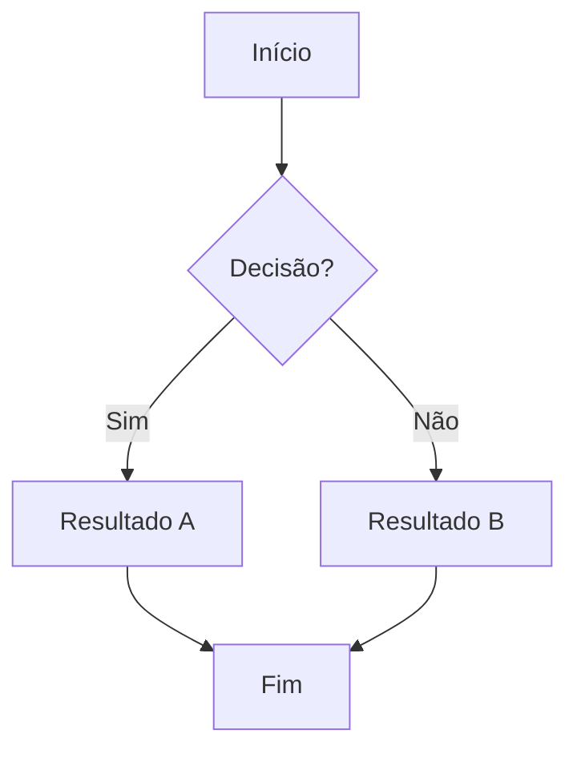
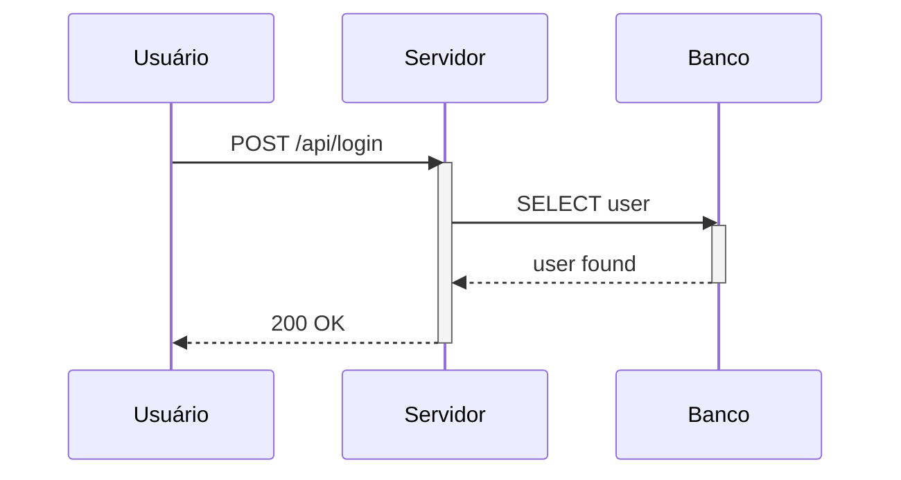
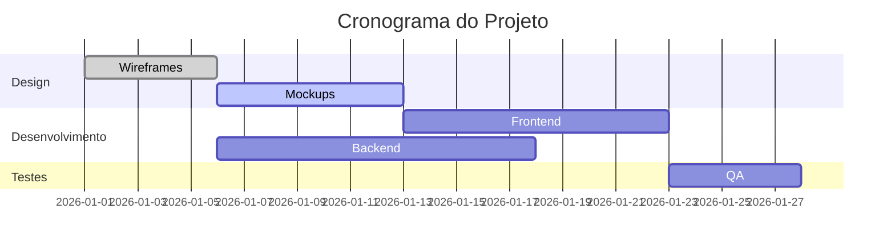
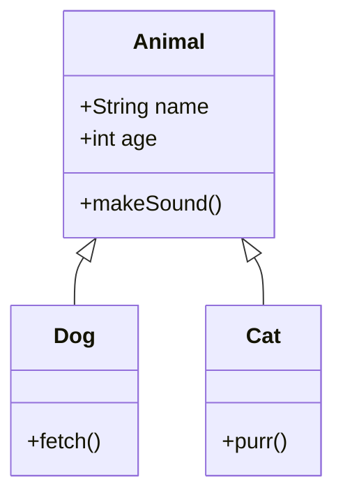
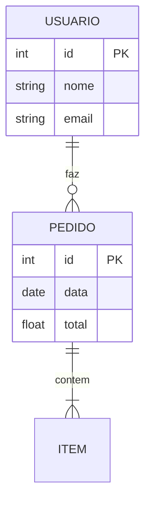
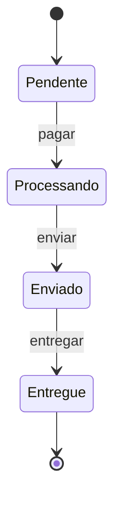
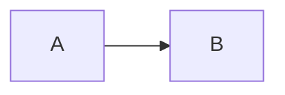

# Manual do Markdown-Studio

Guia completo para aprender, consultar e criar artefatos Markdown do básico ao avançado. Baseado na especificação **CommonMark** e **GitHub Flavored Markdown (GFM)**, com suporte nativo a **KaTeX** (matemática) e **Mermaid** (diagramas).

> O Markdown-Studio renderiza pelo pipeline `marked → DOMPurify → mermaid`. O que funciona aqui funciona no GitHub, GitLab, Obsidian e quase todos os editores modernos.

---

## Índice

### Básico

- [O que é Markdown](#o-que-e-markdown)
- [Primeiros passos](#primeiros-passos)
- [Cabeçalhos](#cabecalhos)
- [Ênfase e formatação](#enfase-e-formatacao)
- [Parágrafos e quebras](#paragrafos-e-quebras)
- [Listas](#listas)
- [Citações](#citacoes)
- [Código](#codigo)
- [Links e imagens](#links-e-imagens)

### Intermediário

- [Tabelas](#tabelas)
- [Listas de tarefas](#listas-de-tarefas)
- [Riscado e autolinks](#riscado-e-autolinks)
- [Escapando caracteres](#escapando-caracteres)
- [HTML dentro do Markdown](#html-dentro-do-markdown)
- [Quebras de página](#quebras-de-pagina)

### Avançado

- [Matemática com KaTeX](#matematica-com-katex)
- [Diagramas com Mermaid](#diagramas-com-mermaid)
- [Referências e âncoras](#referencias-e-ancoras)

### Referência

- [Boas práticas](#boas-praticas)
- [Pegadinhas e soluções](#pegadinhas-e-solucoes)
- [Cheatsheet rápido](#cheatsheet-rapido)
- [Referências oficiais](#referencias-oficiais)

---

# PARTE 1: BÁSICO

---

## O que é Markdown

Markdown é uma **linguagem de marcação leve**: você escreve texto simples com símbolos discretos (`#`, `*`, `-`) e ele vira estrutura formatada (títulos, listas, tabelas, código).

### Camadas do Markdown

| Camada         | O que é                                  | Onde funciona                     |
| -------------- | ---------------------------------------- | --------------------------------- |
| **CommonMark** | Padrão rigoroso (600+ casos de teste)    | Todo lugar                        |
| **GFM**        | Superconjunto: tabelas, tarefas, riscado | GitHub, GitLab, editores modernos |
| **Extensões**  | Math, Mermaid, footnotes                 | Ferramentas específicas           |

**Regra prática**: escreva CommonMark + GFM — funciona em todos os lugares.

### Vantagens do Markdown

- **Simples**: aprende em minutos
- **Portátil**: um arquivo `.md` vira HTML, PDF, DOCX
- **Legível**: o texto fonte é claro mesmo sem renderizar
- **Versionável**: diffs no Git são significativos
- **Universal**: suportado por GitHub, Obsidian, VS Code, Notion, etc.

---

## Primeiros passos

### O editor Markdown-Studio

- **Painel esquerdo**: editor Monaco com syntax highlighting
- **Painel direito**: preview renderizado em tempo real
- **Salvamento automático**: a cada 300ms no `localStorage`
- **Exportação**: PDF (raster ou vetorial), HTML standalone

### Como testar

1. Copie qualquer exemplo deste manual
2. Cole no editor à esquerda
3. Veja o resultado à direita instantaneamente

---

## Cabeçalhos

Use `#` de **1 a 6 níveis**. O `#` **precisa de um espaço** depois.

```markdown
# Título H1 (um por documento)

## Título H2

### Título H3

#### H4 · ##### H5 · ###### H6
```

**Renderiza como:**

# Título H1 (um por documento)

## Título H2

### Título H3

#### H4 · ##### H5 · ###### H6

### Boas práticas

- **Um único `#` (H1)** por documento
- Use `##` e `###` para seções e subseções
- Deixe **linha em branco antes e depois** do cabeçalho
- Prefira `#` à forma alternativa Setext (`===`/`---`)

---

## Ênfase e formatação

| Efeito            | Sintaxe                    | Resultado   |
| ----------------- | -------------------------- | ----------- |
| Itálico           | `*texto*` ou `_texto_`     | _texto_     |
| Negrito           | `**texto**` ou `__texto__` | **texto_    |
| Itálico + Negrito | `***texto***`              | **_texto_** |
| Riscado (GFM)     | `~~texto~~`                | ~~texto~~   |
| Código inline     | `` `código` ``             | `código`    |

**Prefira asteriscos (`*`)** a underscores (`_`): underscore dentro de identificadores (`variavel_nome`) pode ser interpretado como marcação.

---

## Parágrafos e quebras

- **Parágrafo** = texto seguido de **linha em branco**
- **Quebra de linha**: termine com **dois espaços** ou `\`

```markdown
Primeiro parágrafo.

Segundo parágrafo (linha em branco separa).

Primeira linha (dois espaços no fim)  
Segunda linha (mesmo parágrafo).
```

**Dica**: um Enter simples **não** quebra a linha no render.

---

## Listas

### Não ordenadas

Use `-`, `*` ou `+` seguido de espaço. **Escolha um e use sempre** (`-` é o mais comum).

```markdown
- Item 1
- Item 2
  - Subitem
- Item 3
```

**Renderiza como:**

- Item 1
- Item 2
  - Subitem
- Item 3

### Ordenadas

Use número + ponto + espaço. **Atalho**: numerar todos como `1.`

```markdown
1. Primeiro
1. Segundo
1. Terceiro
```

**Renderiza como:**

1. Primeiro
2. Segundo
3. Terceiro

### Sublistas

A regra que mais causa bugs: **indentação suficiente** (4 espaços é seguro).

```markdown
- Item principal
  - Subitem 1
  - Subitem 2
    1. Sub-numérico
    2. Outro
- Próximo item principal
```

---

## Citações

Use `>` no início da linha. Podem conter **qualquer elemento Markdown**.

```markdown
> Markdown é uma linguagem de marcação leve.
>
> > Citações aninhadas usam `>>`.
```

**Renderiza como:**

> Markdown é uma linguagem de marcação leve.
>
> > Citações aninhadas usam `>>`.

---

## Código

### Código inline

Uma crase (\`) envolve texto como código:

```markdown
Rode `npm run quality` antes de commitar.
```

Se o trecho **contiver uma crase**, use **duas** como delimitador:

```markdown
Use ``código com `crase` no meio`` aqui.
```

### Blocos de código (fenced)

Três crases no início (com **linguagem**) e três no fim:

````markdown
```js
const mensagem = 'Olá mundo';
console.log(mensagem);
```

```bash
npm run quality
```

```python
print("Olá mundo")
```
````

**Linguagens suportadas**: js, ts, bash, python, sql, yaml, json, html, css, java, go, rust, etc.

---

## Links e imagens

### Links

```markdown
[Texto do link](https://exemplo.com)
[Link com título](https://exemplo.com 'Título no hover')
```

### Autolinks

```markdown
<https://commonmark.org>
<contato@example.com>
```

### Imagens

```markdown


```

**Dica**: torne o texto alternativo **descritivo** para acessibilidade.

---

# PARTE 2: INTERMEDIÁRIO

---

## Tabelas

Extensão **GFM**. Precisa de **cabeçalho** + **linha separadora** + **células**.

```markdown
| Coluna A | Coluna B | Coluna C |
| -------- | :------: | -------: |
| esquerda |  centro  |  direita |
| foo      |   bar    |      baz |
```

**Renderiza como:**

| Coluna A | Coluna B | Coluna C |
| -------- | :------: | -------: |
| esquerda |  centro  |  direita |
| foo      |   bar    |      baz |

### Alinhamento

| Sintaxe   | Alinhamento       |
| --------- | ----------------- |
| `:---`    | esquerda          |
| `:---:`   | centro            |
| `---:`    | direita           |
| (sem `:`) | esquerda (padrão) |

### Dicas

- `|` literal dentro de célula: escape com `\|`
- Células são **uma linha** (sem colspan no GFM)
- Adicione **linhas em branco** antes e depois

---

## Listas de tarefas

Extensão **GFM**: `- [ ]` para pendente, `- [x]` para concluído.

```markdown
- [x] Documentar o pipeline
- [ ] Adicionar testes
- [ ] Revisar o manual
```

**Renderiza como:**

- [x] Documentar o pipeline
- [ ] Adicionar testes
- [ ] Revisar o manual

---

## Riscado e autolinks

### Riscado (GFM)

```markdown
~~Texto riscado~~
```

**Renderiza como:** ~~Texto riscado~~

### Autolinks

Endereços entre `< >` viram link automaticamente:

```markdown
<https://commonmark.org>
```

GFM converte **URLs nuas** em link. Para texto literal, envolva em crases.

---

## Escapando caracteres

Para mostrar um caractere de marcação como texto, preceda de `\`:

```markdown
\*não é itálico\* \#não é cabeçalho \| não é tabela
```

**Renderiza como:** \*não é itálico\* \#não é cabeçalho \| não é tabela

---

## HTML dentro do Markdown

O Markdown-Studio permite **HTML leve** (sanitizeado por DOMPurify):

```markdown
<details>
  <summary>Seção recolhível</summary>

Conteúdo dentro do HTML.

</details>
```

**Segurança**: `<script>`, atributos `on*` e URLs `javascript:` são removidos.

---

## Quebras de página

O Markdown-Studio suporta marcador `<!-- page-break -->` para impressão/PDF:

```markdown
Conteúdo da primeira página.

<!-- page-break -->

Conteúdo da segunda página.
```

**Uso**: ao exportar PDF ou imprimir, o conteúdo após o marcador começa em nova página.

---

# PARTE 3: AVANÇADO

---

## Matemática com KaTeX

O Markdown-Studio suporta nativamente **KaTeX** para fórmulas matemáticas.

### Sintaxe básica

| Modo       | Sintaxe   | Exemplo                                  |
| ---------- | --------- | ---------------------------------------- |
| **Inline** | `$...$`   | `$x^2$` renderiza $x^2$                  |
| **Bloco**  | `$$...$$` | `$$\frac{a}{b}$$` renderiza centralizado |

### Exemplos inline

```markdown
A fórmula é $x = \frac{-b \pm \sqrt{b^2 - 4ac}}{2a}$.

Onde $a \neq 0$ e $b^2 - 4ac \geq 0$.
```

### Exemplos em bloco

```markdown
$$
\sum_{i=1}^{n} i = \frac{n(n+1)}{2}
$$
```

```markdown
$$
\int_{0}^{\infty} e^{-x^2} dx = \frac{\sqrt{\pi}}{2}
$$
```

### Símbolos comuns

| Categoria      | Símbolos                                                            |
| -------------- | ------------------------------------------------------------------- |
| **Gregas**     | `\alpha` `\beta` `\gamma` `\delta` `\theta` `\pi` `\sigma` `\omega` |
| **Operadores** | `\sum` `\prod` `\int` `\partial` `\nabla`                           |
| **Relações**   | `\leq` `\geq` `\neq` `\approx` `\in` `\subset`                      |
| **Setas**      | `\rightarrow` `\leftarrow` `\leftrightarrow` `\Rightarrow`          |
| **Frações**    | `\frac{a}{b}` `\dfrac{a}{b}` `\cfrac{1}{1+\cfrac{1}{2}}`            |
| **Raízes**     | `\sqrt{x}` `\sqrt[3]{8}`                                            |
| **Matrizes**   | `\begin{pmatrix} a & b \\ c & d \end{pmatrix}`                      |

### Exemplos reais

**Física — Equivalência massa-energia:**

```markdown
$$E^2 = (pc)^2 + (m_0 c^2)^2$$
```

**Estatística — Distribuição normal:**

```markdown
$$f(x) = \frac{1}{\sigma\sqrt{2\pi}} e^{-\frac{(x-\mu)^2}{2\sigma^2}}$$
```

**Álgebra linear — Autovalores:**

```markdown
$$A\mathbf{v} = \lambda\mathbf{v}$$
```

### Dicas para KaTeX

1. **Linhas em branco** antes e depois de blocos `$$`
2. **Escape** sinais especiais: `\$50` para dólar literal
3. Use `\text{}` para palavras dentro de equações
4. Use `\left` e `\right` para colchetes auto-dimensionados
5. Teste no editor antes de publicar

---

## Diagramas com Mermaid

O Markdown-Studio suporta nativamente **Mermaid** para diagramas.

### Flowchart (fluxograma)

````markdown

````

**Tipos de nó:**

| Sintaxe     | Forma          | Exemplo          |
| ----------- | -------------- | ---------------- |
| `[texto]`   | Retângulo      | `[Processo]`     |
| `(texto)`   | Arredondado    | `(Alternativa)`  |
| `{texto}`   | Losango        | `{Decisão}`      |
| `([texto])` | Estádio        | `([Início/Fim])` |
| `[(texto)]` | Banco de dados | `[(MySQL)]`      |
| `((texto))` | Círculo        | `((Conector))`   |
| `[[texto]]` | Sub-rotina     | `[[Função]]`     |
| `{{texto}}` | Hexágono       | `{{Preparação}}` |

### Sequence Diagram (diagrama de sequência)

````markdown

````

**Tipos de mensagem:**

| Sintaxe | Significado                   |
| ------- | ----------------------------- |
| `->>`   | Seta sólida (síncrono)        |
| `-->>`  | Seta tracejada (resposta)     |
| `-x`    | Seta com x (mensagem perdida) |
| `--)`   | Seta aberta (assíncrono)      |

### Gantt (cronograma)

````markdown

````

### Class Diagram (diagrama de classes)

````markdown

````

### ER Diagram (diagrama entidade-relacionamento)

````markdown

````

### State Diagram (diagrama de estados)

````markdown

````

### Dicas para Mermaid

1. **Sempre defina a direção** do flowchart: `TD`, `TB`, `LR`, `RL`, `BT`
2. **Escape caracteres especiais** em nós: `A["Processo (v2)"]`
3. **Use `%` para comentários**: `% isto é um comentário`
4. **Cuidado com palavras reservadas**: "end" pode quebrar diagramas
5. **Teste no editor** antes de publicar

---

## Referências e âncoras

### Links por referência

Define o destino uma vez e reusa:

```markdown
Veja a [documentação][docs] e a [especificação][spec].

[docs]: https://example.com/docs 'Docs oficiais'
[spec]: https://example.com/spec 'Especificação'
```

### Âncoras internas

Cabeçalhos ganham `id` automático. Link direto para seção:

```markdown
[Voltar ao índice](#indice)
```

---

# PARTE 4: REFERÊNCIA

---

## Boas práticas

1. **Um H1 por documento**; `##`/`###` para seções
2. **Linhas em branco** entre blocos
3. **Um marcador de lista só** (`-` em todo o documento)
4. **Asteriscos** para ênfase (`*itálico*`, `**negrito**`)
5. **Linguagem sempre** nos blocos de código
6. **Alt text descritivo** em toda imagem
7. **Indentação de 4 espaços** para sublistas
8. **Links por referência** quando o mesmo URL aparece várias vezes
9. **Pense em quem lê**: Markdown bom é legível em texto puro

---

## Pegadinhas e soluções

| Pegadinha               | Causa                   | Solução                      |
| ----------------------- | ----------------------- | ---------------------------- |
| Título não renderiza    | `#` sem espaço          | `# Título`                   |
| Lista quebra            | Marcadores diferentes   | Fixar `-`                    |
| Sublista vira parágrafo | Indentação insuficiente | 4 espaços                    |
| Enter não cria linha    | Só um Enter junta       | Linha em branco ou 2 espaços |
| Ênfase em `variavel_um` | `_` interpretado        | Usar `*`                     |
| Tabela falha            | Sem linha separadora    | Incluir `\|--\|--\|`         |
| Crase dentro de código  | Uma crase interrompe    | Usar duas: `` `código` ``    |
| Strikethrough falha     | `~texto~` (uma til)     | `~~texto~~` (GFM)            |
| KaTeX não renderiza     | `$ x+1 $` (espaço)      | `$x+1$` (sem espaço)         |
| Mermaid quebra          | Palavra "end"           | Usar aspas: `["end"]`        |

---

## Cheatsheet rápido

````markdown
# Título

## Subtítulo

**negrito** _itálico_ ~~riscado~~ `código`

- lista

1. numerada

> citação

[link](https://exemplo.com)


```js
console.log('código');
```

| a   | b   |
| --- | --- |
| 1   | 2   |

- [ ] tarefa

$x^2$ (KaTeX inline)

$$\sum_{i=1}^{n} i$$ (KaTeX bloco)



<!-- page-break -->
````

---

## Referências oficiais

- **CommonMark Spec** — <https://spec.commonmark.org>
- **GFM Spec** — <https://github.github.io/gfm>
- **KaTeX** — <https://katex.org/docs/supported.html>
- **Mermaid** — <https://mermaid.js.org>
- **CommonMark Help** — <https://commonmark.org/help>

---

_Manual do Markdown-Studio v1.2 — Atualizado em setembro de 2026_
